# Data Science Academy Project: ChatGPT Tweet's Sentiment Analysis

## Project Description

ChatGPT is the AI-based conversational system offered by **OpenAI**. It was launched at the end of 2022 and has since received attention from the general public who finally realized how AI has evolved and is already among us.

Sentiment about ChatGPT has divided opinions. While some recognize that ChatGPT can be a useful tool for the daily lives of various activities, others express fear of being replaced by AI.

But which sentiment prevails on social media? Answering this question is your job in this project. Through the analysis of Tweets about ChatGPT, you must build an analysis process that allows you to identify the sentiment that predominates, especially on Twitter, about ChatGPT. This project could be extended to reflect sentiment on other topics, for example.

## Data dictionary

1. Datetime:  Clearly the time a tweet was created.
Description: Date and time of tweet creation.
Data Type: Datetime (or String representing datetime). Let's assume Datetime for analysis purposes, but note it could be string initially.
Possible Values: "2023-10-27 10:30:00 UTC", "2023-10-26T15:45:22Z" (ISO formats). Consider time zones - likely UTC for Twitter data.
Notes: Timezone considerations, format variations.

2. Tweet Id: Unique identifier for each tweet.
Description: Unique ID for the tweet on Twitter.
Data Type: String (or Integer, but often represented as string to avoid overflow/precision issues). String is safer.
Possible Values: "1717171717...", Long numeric strings.
Notes: Crucial for identifying unique tweets. Used in APIs.

3. Text:  The actual content of the tweet.
Description: Tweet's text content.
Data Type: String.
Possible Values: "Just tried ChatGPT, amazing!", "Is anyone else having issues with ChatGPT today?", Varied text content.
Notes: Might contain hashtags, mentions, URLs. Needs cleaning and processing for NLP tasks.

4. Username:  The user's handle.
Description: Twitter handle (screen name) of the user.
Data Type: String.
Possible Values: "@elonmusk", "@OpenAI", "@TechCrunch". Starts with "@" usually.
Notes: Used to identify users on Twitter.

5. Permalink: Direct URL to the tweet.
Description: Permanent link/URL to view the tweet directly on Twitter.
Data Type: String.
Possible Values: "https://twitter.com/username/status/1234567890". Standard Twitter URL format.
Notes: Useful for direct access and sharing.

6. User:  User object/dictionary - Hmm, this is interesting, we already have Username. What's User?  It's likely more detailed user info. Let's assume it's structured data because it's called "User" not just "UserId"
Description: Detailed information about the tweet's author. Likely a nested structure.
Data Type: Dictionary/JSON object (or perhaps a separate table if relational, but less likely in a flat dataset). Let's assume dictionary/JSON for now.
Possible Values: {'id': '123...', 'name': 'Elon Musk', 'followers_count': 100000000, ...} Think about common user profile info.
Notes: Likely contains more than just username (like follower count, profile description, etc.). Need to emphasize it's nested data. Clarify relationship with Username - Username is likely a key within the User object. Actually, scratch that, Username is probably just the string handle, and User is the whole user object, including the handle.

7. Outlinks: URLs mentioned in the tweet going outwards to other sites.
Description: URLs included in the tweet text that link to external websites.
Data Type: List/Array of Strings. (A tweet might have multiple outlinks).
Possible Values: ["https://openai.com/blog", "https://example.com/news"]. List of URLs.
Notes: Useful for link analysis, understanding tweet context beyond Twitter.

8. CountLinks: Number of outlinks - Simple count of the previous column.
Description: Number of URLs in the tweet text linking to external websites.
Data Type: Integer.
Possible Values: 0, 1, 2, 3... Non-negative integers.
Notes: Redundant if Outlinks is available, but convenient for quick analysis. Point out redundancy, but explain utility.

9. ReplyCount, RetweetCount, LikeCount, QuoteCount:  Engagement metrics.
Description: Number of replies, retweets, likes, and quote tweets received.
Data Type: Integer.
Possible Values: 0, 10, 100, 1000... Non-negative integers.
Notes: Key engagement metrics. Clearly explain each one's meaning.

10. ConversationId: ID for the entire conversation thread.
Description: ID of the conversation thread this tweet belongs to. Tweets in the same thread share the same ID.
Data Type: String (or Integer). String again, safer for IDs.
Possible Values: "12345...", "56789...". Unique ID per thread.
Notes: Connects replies, quotes, etc. into conversations. Explain its purpose for thread analysis.

11. Language:  Language of the tweet.
Description: Language of the tweet content, detected by Twitter.
Data Type: String (or language code). String is more descriptive.
Possible Values: "en" (English), "es" (Spanish), "fr" (French), "und" (Undetermined). ISO language codes, maybe full language names.
Notes: Language detection. Might be imperfect. "und" is important.

12. Source: Platform/app used to tweet.
Description: Source application or platform used to post the tweet (e.g., Twitter Web App, Twitter for iPhone).
Data Type: String.
Possible Values: "Twitter Web App", "Twitter for Android", "TweetDeck". Platform names.
Notes: Device/platform used. Useful for platform-specific analysis.

13. Media: Media attached to the tweet - Like User, "Media" is plural and suggests structured data.
Description: Information about media (images, videos, GIFs) attached to the tweet.
Data Type: List/Array of Dictionaries/JSON objects. (Multiple media items possible). List of dictionaries.
Possible Values: [{'type': 'photo', 'url': '...'}, {'type': 'video', 'url': '...', 'duration': '...'}]. Think about media types and attributes.
Notes: Presence and details of media. Nested data again, like User. Emphasize list of dictionaries.

14. QuotedTweet:  Details of a quoted tweet - Structured, single, since it's "QuotedTweet" singular.
Description: If the tweet is a quote tweet, this column contains information about the original tweet being quoted.
Data Type: Dictionary/JSON object (or Null if not a quote tweet).
Possible Values: A dictionary similar to the overall tweet structure, but for the quoted tweet, or null/None if not a quote. Recursive structure almost!
Notes: Nested tweet data for quote tweets. Handle null values.

15. MentionedUsers: Users mentioned in the tweet. Plural - list.
Description: List of Twitter users mentioned (@usernames) in the tweet.
Data Type: List/Array of Dictionaries/JSON objects (or maybe just list of usernames as strings - but dictionaries are richer). Let's assume dictionaries to be consistent with User and Media. Dictionaries are better.
Possible Values: [{'username': '@elonmusk', 'id': '...'}, {'username': '@BillGates', 'id': '...'}]. Details about mentioned users.
Notes: Users mentioned in the tweet text. List of user-like objects.

16. hashtag: Hashtags in the tweet. Singular in name, but likely multiple hashtags per tweet, so still a list.  Maybe should have been hashtags? Let's assume it's intended for all hashtags.
Description: Hashtags included in the tweet text (without the '#' symbol).
Data Type: List/Array of Strings.
Possible Values: ["ChatGPT", "AI", "Innovation"]. List of hashtag strings.
Notes: Hashtags extracted. Explain without "#" symbol.

17. hastag_counts:  Counts of each hashtag - Number of times each hashtag appears in the tweet?  Unlikely. More likely just the number of hashtags in the tweet.  Let's assume count of hashtags in the tweet, similar to CountLinks.  Typo in name "hastag" -> "hashtag".
Description: Number of hashtags included in the tweet text.
Data Type: Integer.
Possible Values: 0, 1, 2, 3... Non-negative integer.
Notes: Count of hashtags. Redundant if hashtag is available, but convenient. Redundancy note.

## Results

The following feature engineering procedure was performed in some numeric variables in order to deal with attributes in very different scales:

- df['LikeCount'] = np.log1p(df['LikeCount']),
- df['QuoteCount'] = np.log1p(df['QuoteCount']),
- df['ReplyCount'] = np.log1p(df['ReplyCount']),
- df['RetweetCount'] = np.log1p(df['RetweetCount']),

i.e., **the features have been log-transformed**.

### Violin plots for Numeric columns

The following figure addresses the violin plots for the numeric columns present in this dataset, showing the shape of the distribution for each numeric feature and evidencing that in this dataset there are a lot of outliers.

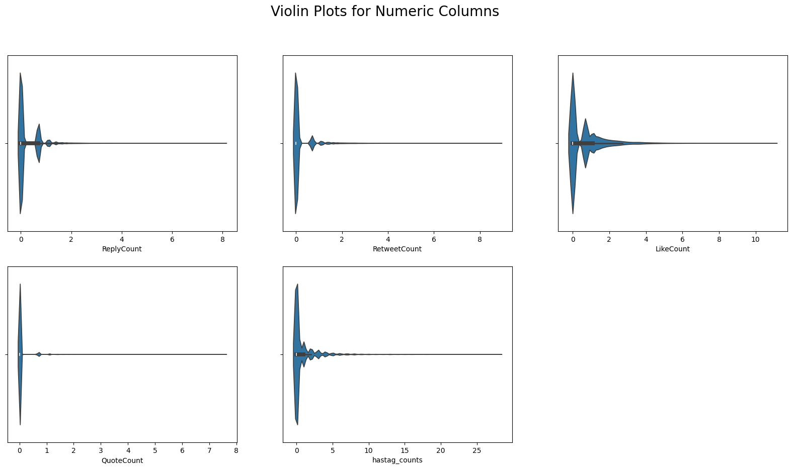

### Feature's distribution

The next figure shows the feature's distribution for the attributes present in this dataset.

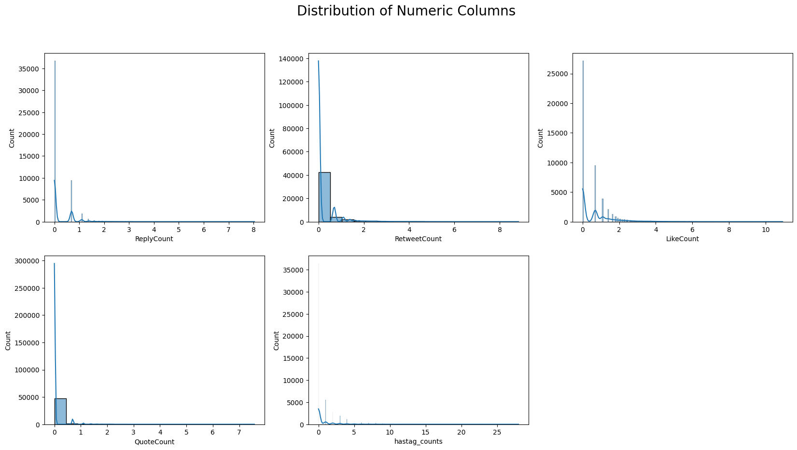

### Top 20 Users By Tweet Count

The next image shows the top 20 users sorted by the total number of tweet counts.

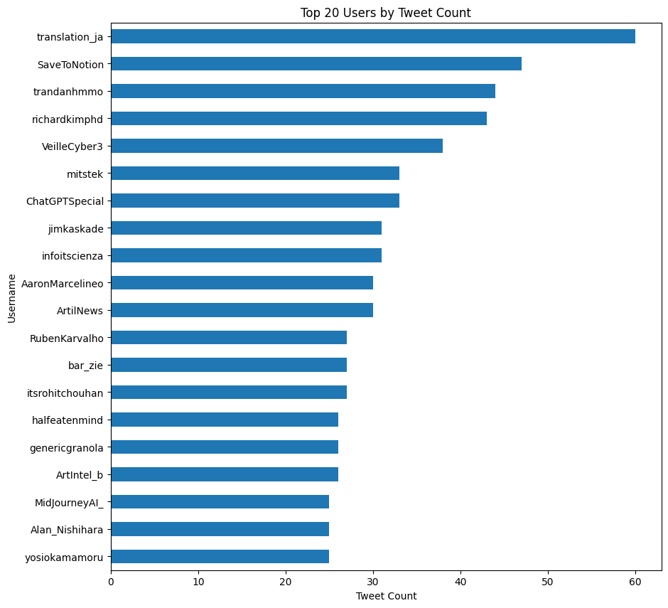

### Media Type Distribution

The next image addresses the the media type distribution for the instances in this dataset.

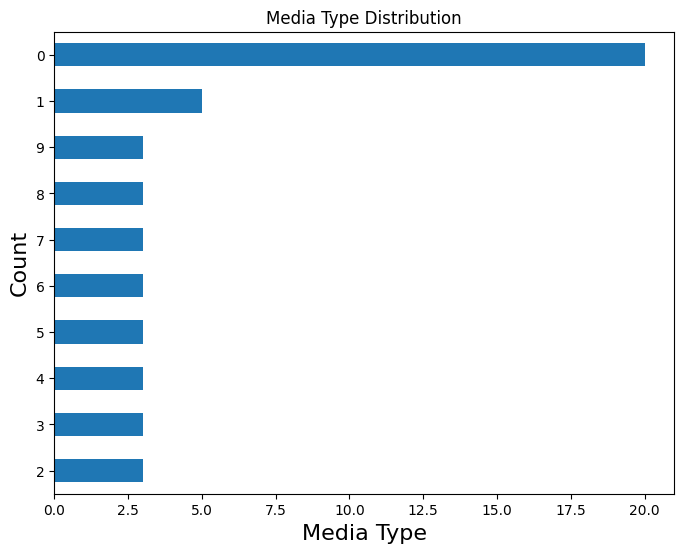

### Languages present in the dataset

The following figure shows all the languages that were recognized by inspecting the whole dataset, along with its respective number of instances. It is evident that the English language is by far the predominant language.

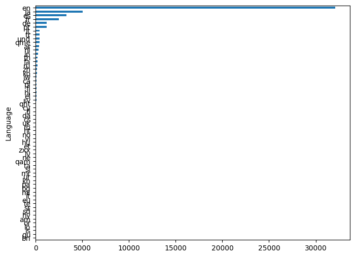

### Top 10 languages present in the dataset

The next figure addresses the top 10 languages present in this dataset, which are *English, Japanish, Spanish, French, German, Portuguese, Italian*, and so on.

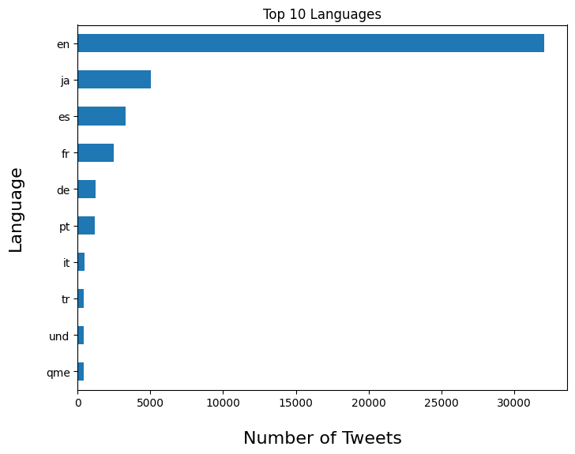

### Boxplot of Retweet Count

The next figure shows a boxplot of the retweet counts for the instances in this dataset, clearly showing that its most values lay around 0 and can reach up to more than 8 (remember this feature was log-transformed). Therefore, there might be severe outliers in this feature.

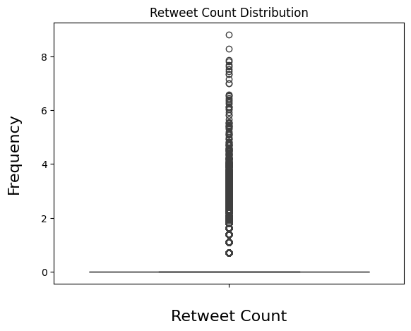

### Reply Boxplot

The following addresses the total number of replies for a given twitter, which lay mainly around 0, but can contain several outliers (the log-transformation was previously applied), distorting its distribution.

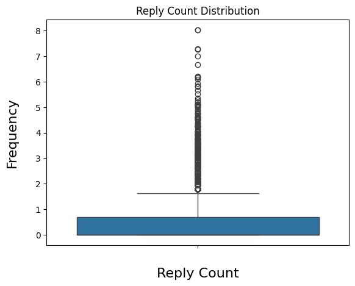

### Top 10 Reply Counts

The next figure shows the average top 10 reply totalled that were observed in this dataset

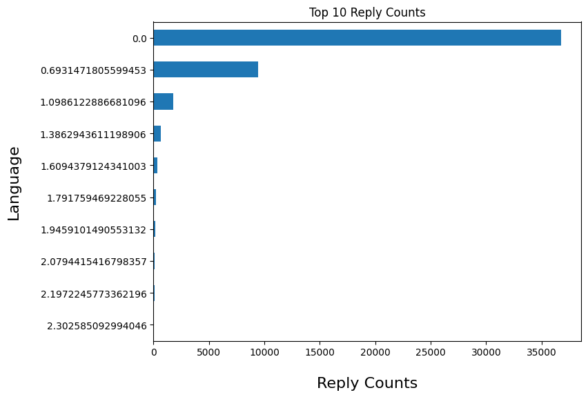

### Like Count Distribution

The following figure depicts a boxplot of the Like count attribute, suggesting a large number of outliers, since this scale is log-transformed.

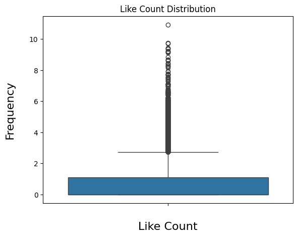

### Quote Count Boxplot

The following figure shows the Quote count feature in a boxplot, since this is a log-transformed scale, it is noticeable that the Quote count can vary from 0-108!! There are a plenty of outliers

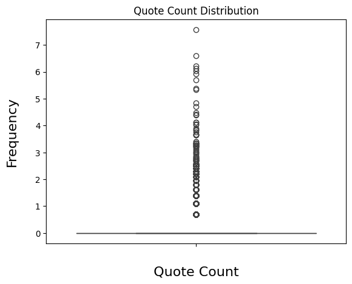

### Top 10 hashtags

The following figure shows the top 10 hashtags present in this dataset, and clearly, besides an empty hashtag, "ChatGPT" and "AI" are the most common hashtags.

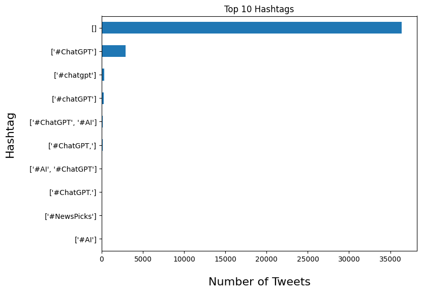

### Boxplot of hashtag counts

The next figure addressesa boxplot of the hashtag counts in this dataset, evidencing that there are several outliers

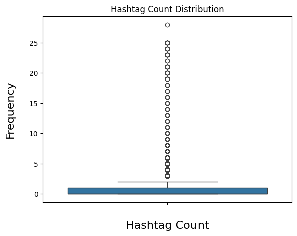

### Top 20 sources

The next figure shows the top 20 sources, from which the Twitters have been sent. The top 3 sources, respectively, are: Twittes from Web Apps, Twittes from IPhone, Twitters from Android.

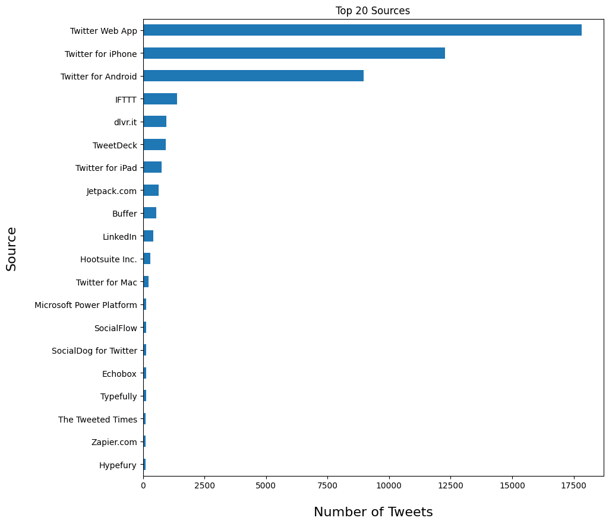

### Like Count Boxplot for the top 5 sources

The following figure shows the like count boxplots as a function of the top 5 sources, from which one can notice that there are several outliers regarding the feature *LikeCount*, and Twittes in Android seems to have a much different distribution than in IPhone and Web Apps.

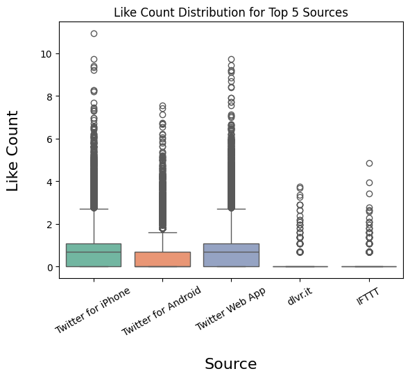

### Text length distribution

The following figure shows the text length distribution for the sentences present in this dataset, which seems to be some kind of a bimodal distribution.

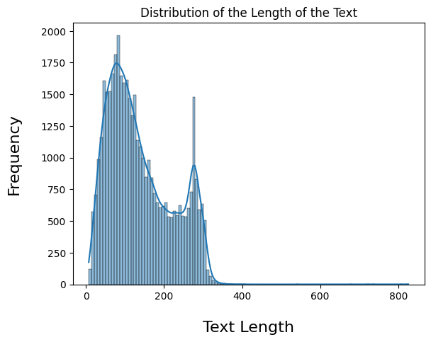

### Text length distribution by source

The next figure addresses the text length distribution discriminated by the top 5 sources, from which one can notice that the overall distribution seems to be a sum of 5 similar distributions.

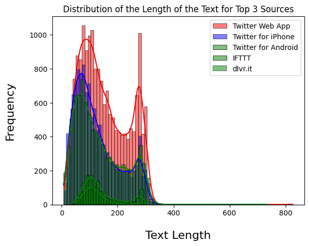

### Boxen plot of the text length

The next figure shows a boxen plot of the text length distribution of the sentences present in this dataset.

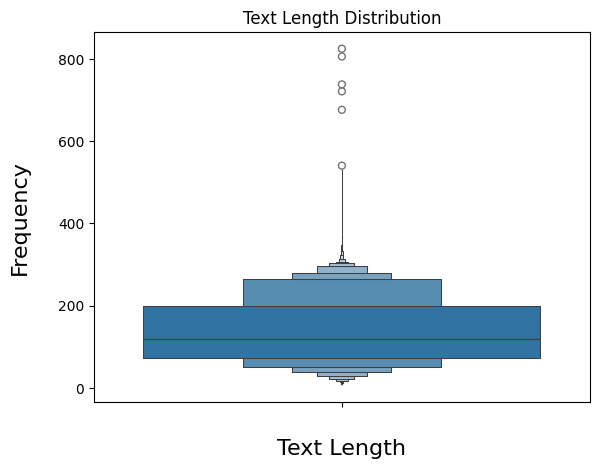

### Boxen plot of the text length by source

The following figure shows a boxen plot of the text length discriminated by the source of Twitter posting, from which one can clearly notice that the distributions are indeed similar for Twittes posted in IPhone, Android, and Web Apps.

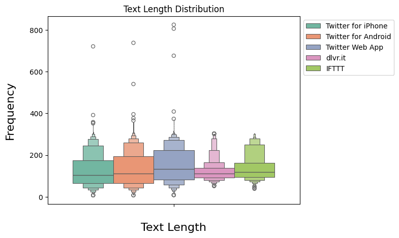

### Distribution of the number of words

The next figure shows the number of words distribution in the whole dataset instances, that seems to be made up of two independent distributions. Remarkably, there seems to be some spikes in the word's count distribution.

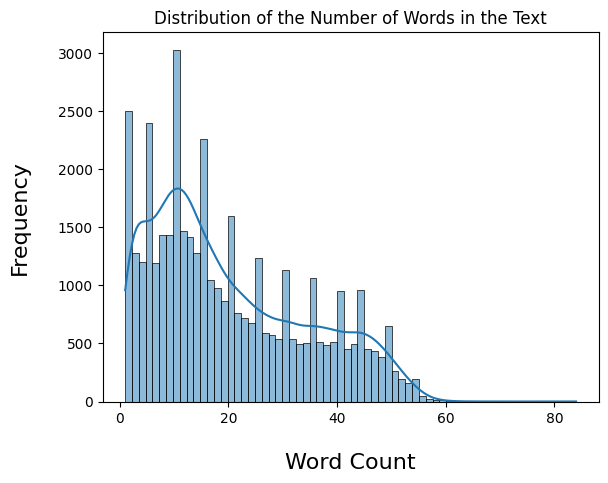

### Unique words

The following figure shows a distribution of the unique words for each instance present in this dataset in terms of the sources of Twitter posting. Interestingly, the shape of each source of Twitter posting seems to similar to the others. 

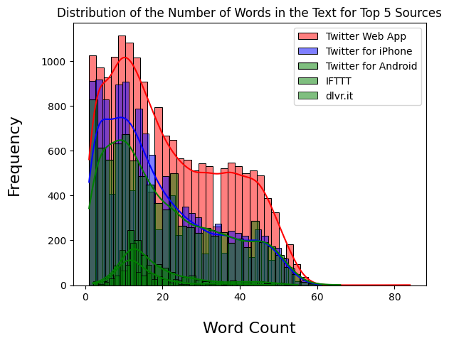

### Boxen plot of Word counts

The following figure presents a boxen plot of the word counts of the instances present in this dataset.

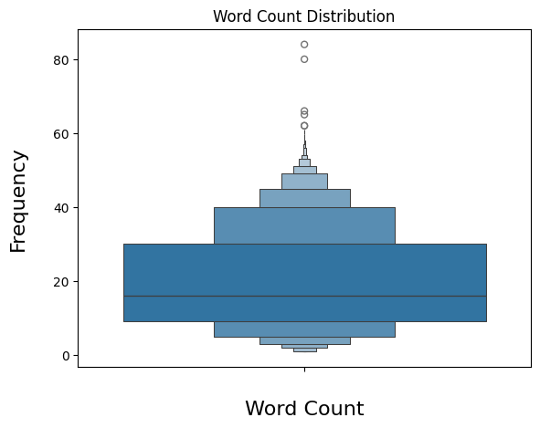

### Boxen plot of Word counts by source

The following figure shows a boxen plot of the word counts of each instance in this dataset, segmented by source of Twitter posting.

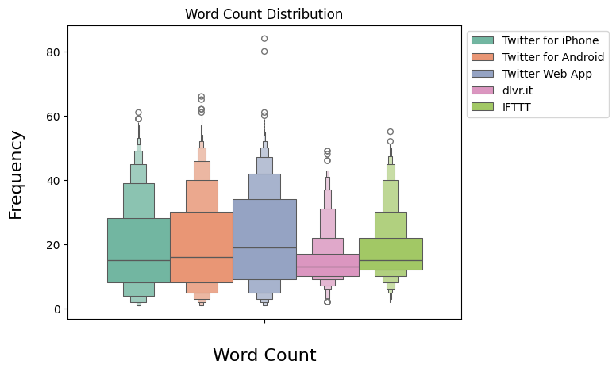

### Violin plot of the top 5 sources

The following figure shows violin plots of the top 5 sources of Twitter Posting for 5 featues: *ReplyCount, RetweetCount, LikeCount, QuoteCount, and hashtag_counts"...

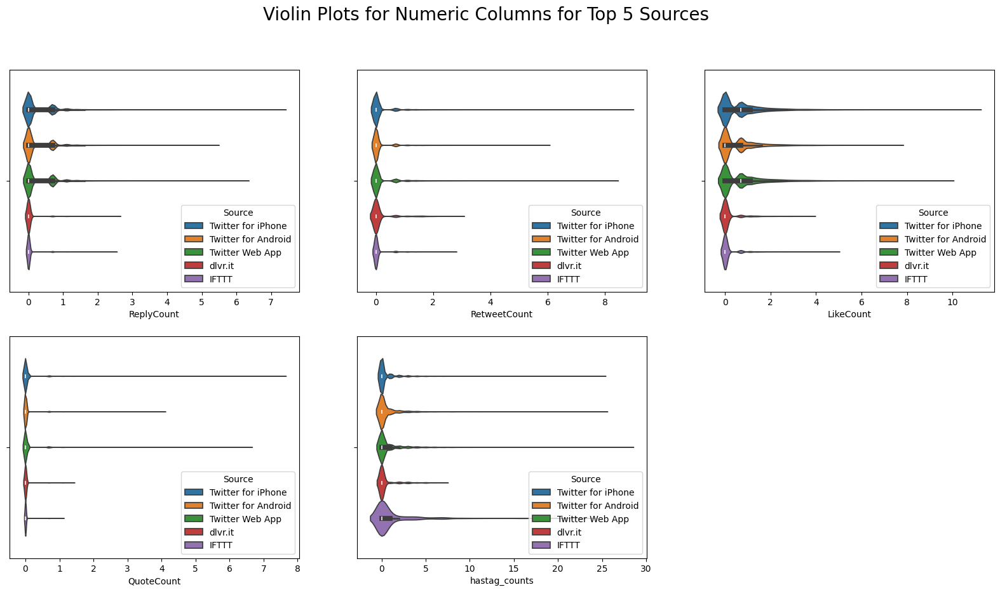

### Boxen Plot of the top 5 sources

The following figure shows boxen plots of the top 5 sources of Twitter Posting for 5 featues: *ReplyCount, RetweetCount, LikeCount, QuoteCount, and hashtag_counts"...

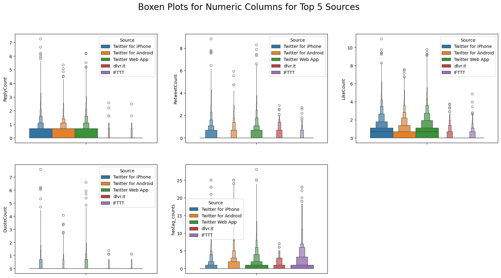

### Descriptive statistics

Descriptive statistics for the whole dataset is shown in the next figure.
One can notice that there is a relatively large amount of tweets (50001) in all languages, and other attribute's statistics can be obtained from the table.

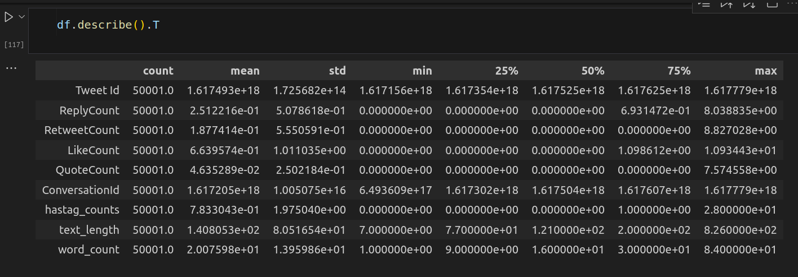

### Descriptive statistics for Twittes in English

Descriptive statistics for Twittes in Portuguese for the whole dataset is shown in the next figure.
One can notice that there is a large amount of tweets (32076) and other attribute's statistics can be obtained from the table.

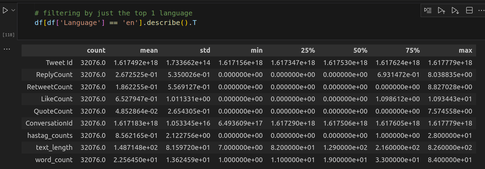

### Descriptive statistics for Twittes in Portuguese

Descriptive statistics for Twittes in Portuguese for the whole dataset is shown in the next figure.
One can notice that there is a small amount of tweets (1175) and other attribute's statistics can be obtained from the table.

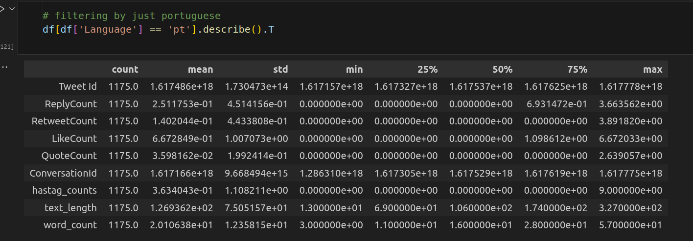

### Distribution of sentiments

The next figure shows the sentiment distribution present in this dataset, from which one can clearly notice that neutral sentiments (zero values) have a significant amount in this dataset, and there seems to be a right-skewed distribution towards positive sentiments.

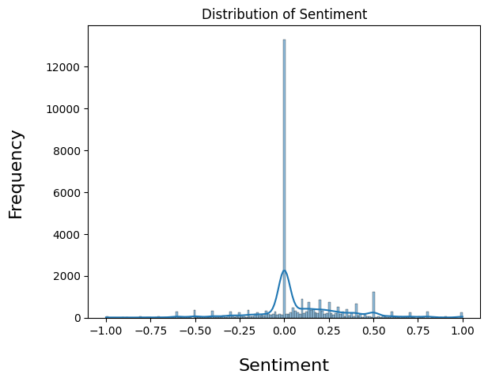

### Distribution of subjectivity

It is shown in the next figure the distribution of subjectivity in this dataset instances, from which one can observe that the *zero values for subjectivity* are predominant in this dataset.

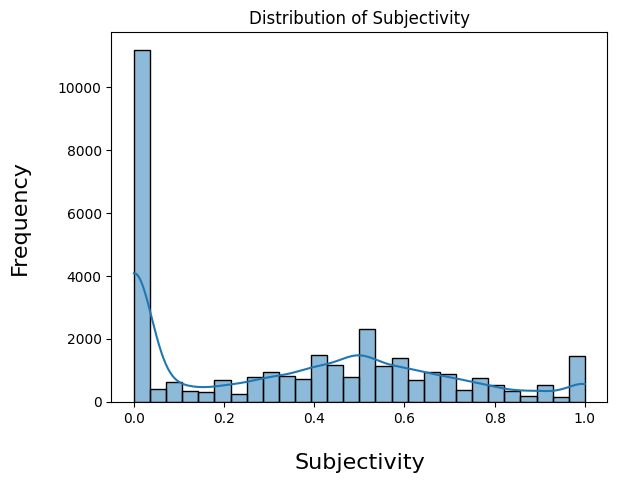

### Objective vs Subjective

In regards of objectivity against subjectivity of the sentences in this dataset, in general, as depicted in the next figure, there is a major contribution of *well-defined objective* sentences.

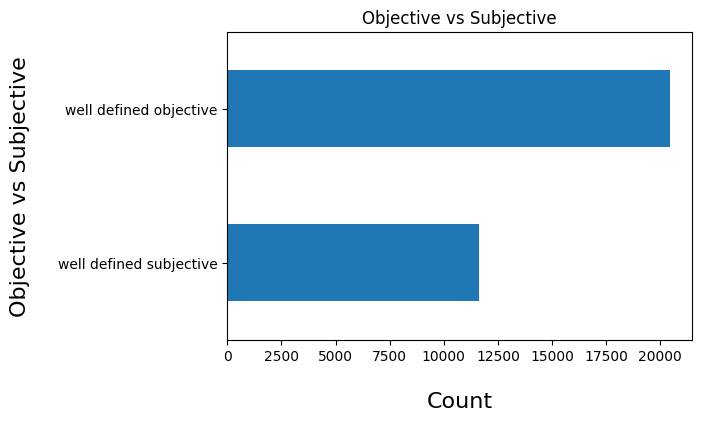

### Distribution of polarity

The following figure shows the polarity distribution the sentiments in this dataset, from which one can notice that the positive sentiment is predominant, followed by neutral, and the negative sentiment is relatively small.

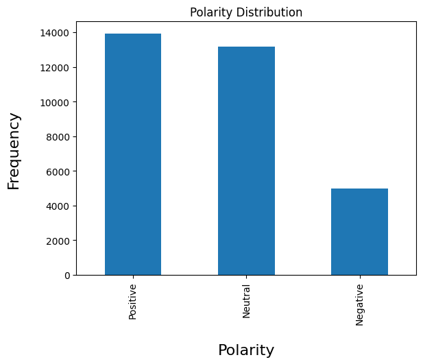

### Polarity vs subjectivity

The following figure addresses the polarity of the sentences discriminated by its subjectivity, from which one can notice that the neutral sentiment is very objective, while negative and positive sentiments tend to be a bit more subjective than objective.

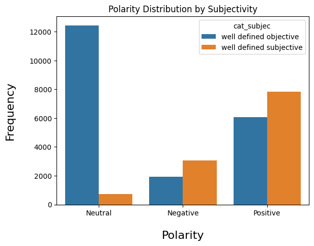

### Top 10 most common words

The next figure shows the top 20 words obtained by analyzing this dataset. The top 3 most common words are: "chatgpt", "ai", and "it".

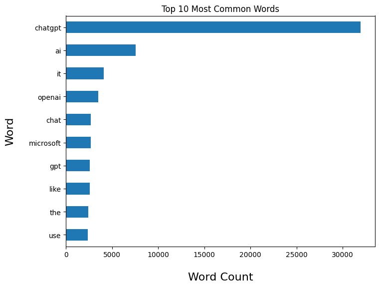

### Top 20 bigrams

The next figure shows the top 20 bigrams obtained by analyzing this dataset. The top 3 bigrams are: "chat gpt", "use chatgpt", and "using chatgpt".

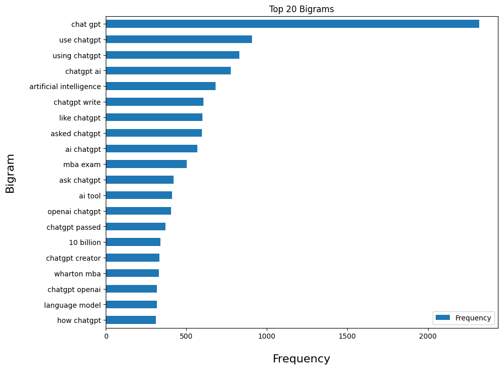

### Top 20 trigrams
The next figure shows the top 20 trigrams obtained by analyzing this dataset. The top 3 trigrams are: "chatgpt creator openai", "wharton mba exam", and "medical licensing exam".

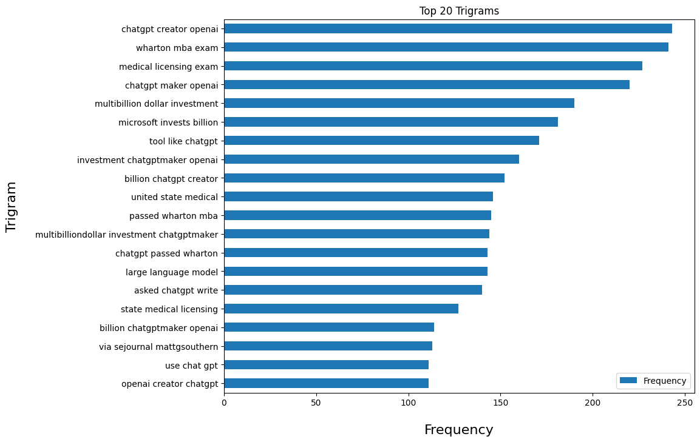

## Summary of Key Findings

1. **Data Preprocessing and Feature Engineering**:

Numeric features (LikeCount, QuoteCount, ReplyCount, RetweetCount) were log-transformed to address scaling issues and potential outliers.

2. **Data Distribution and Outliers**:

Violin and box plots revealed significant outliers in numeric features.
Distributions of numeric features were skewed, indicating non-normal distributions.
Retweet, reply, like, and quote counts showed a concentration around 0 with many high outliers.
Hashtag counts also showed many outliers.
Text length and word counts showed bimodal distributions.

3. **Content and Language Analysis**:

English was the predominant language, followed by Japanese, Spanish, and other languages.
"ChatGPT" and "AI" were the most common hashtags.
The most common words are "chatgpt", "ai", and "it".
The most common bigrams are "chat gpt", "use chatgpt", and "using chatgpt".
The most common trigrams are "chatgpt creator openai", "wharton mba exam", and "medical licensing exam".

4. **User and Source Analysis**:

The top 20 users by tweet count were identified.
The most common tweet sources were web apps, iPhones, and Android devices.
Like count distributions varied across the top 5 sources (web, iPhone, Android, etc.).
Text length and word count distributions were similar across the top sources.

5. **Sentiment and Subjectivity Analysis**:

Neutral sentiments were most frequent, with a right-skewed distribution towards positive sentiments.
Objective sentences were more prevalent than subjective ones.
Positive polarity was predominant, followed by neutral and then negative.
Neutral sentiments were highly objective, while positive and negative sentiments showed more subjectivity.

6. **Key Observations**:

The dataset contains a significant amount of social media data related to "ChatGPT" and "AI".
Outliers are a significant issue in many numeric features.
English is the dominant language.
Neutral and positive sentiments are more common than negative sentiments.
Most sentences are objective.

## Real-world Scenario Usages

1. **Social Media Monitoring and Trend Analysis**:

**Scenario**: A company wants to understand public perception of their AI product (related to ChatGPT) on Twitter.
**Usage**:
Track the prevalence of "ChatGPT" and "AI" hashtags to gauge topic popularity.
Monitor sentiment distribution to assess positive, negative, or neutral reactions.
Analyze top bigrams and trigrams to identify common phrases and associated topics (e.g., "use ChatGPT," "ChatGPT creator OpenAI").
Identify top users and sources to understand who is driving the conversation.
Track languages used to understand the global reach of the product.
Monitor the evolution of the sentiment of the tweets over time, in order to rapidly react to any sudden shift in public opinion.

2. **Content Moderation and Spam Detection**:

**Scenario**: A social media platform needs to filter spam and identify potentially harmful content related to AI.
**Usage**:
Identify accounts with unusually high tweet counts or reply counts (potential bots or spam).
Detect outliers in like, retweet, and quote counts, which might indicate manipulated engagement.
Analyze text length and word count distributions to identify repetitive or automated content.
Filter tweets with a very high rate of hashtags, as this can be a sign of spam.
Use the sentiment analysis to detect highly negative or toxic tweets.

3. **Marketing and Customer Insights**:

**Scenario**: A marketing team wants to tailor their campaigns to specific user segments based on their social media behavior.
**Usage**:
Segment users based on their preferred tweet sources (iPhone, Android, web) and tailor content accordingly.
Analyze language distribution to create multilingual campaigns.
Identify popular hashtags and keywords to optimize content for search and social media visibility.
Use the sentiment analysis to understand what kind of marketing messages resonates better with the audience.
Understand the most used words, bigrams and trigrams to adapt the marketing language.

4. **Product Development and Feature Prioritization**:

**Scenario**: An AI product developer wants to understand user feedback and prioritize feature enhancements.
**Usage**:
Analyze user sentiment and subjectivity to identify pain points and areas for improvement.
Identify common words and phrases used by users to understand their needs and preferences.
Track reply and quote counts to gauge user engagement and interest in specific features.
Analyze the media type distribution to understand what kind of media is more engaged by the users.

5. **Research and Academic Studies**:

**Scenario**: Researchers want to study the social impact of AI technologies like ChatGPT.
**Usage**:
Analyze language distribution to understand the global spread of AI conversations.
Study sentiment and polarity patterns to assess public perception and ethical concerns.
Analyze hashtag usage to identify emerging trends and subtopics.
Study the evolution of the vocabulary used in the tweets, to understand how the conversations around AI are changing.

6. **Crisis Management**:

**Scenario**: A company faces a public relations crisis related to their AI product.
**Usage**:
Monitor sentiment and polarity in real-time to track the severity of the crisis.
Identify key influencers and sources spreading negative information.
Analyze common words and phrases to understand the root cause of the crisis.
Use the language detection to understand in what countries the crisis is more intense.

## Acknowledgements

Kaggle is acknowledged for having provided the dataset and Data Science Academy for the course and project specifications.

## MIT License

### Copyright (c) [2025] [Vagner Zeizer Carvalho Paes]

Permission is hereby granted, free of charge, to any person obtaining a copy
of this software and associated documentation files (the "Software"), to deal
in the Software without restriction, including without limitation the rights
to use, copy, modify, merge, publish, distribute, sublicense, and/or sell
copies of the Software, and to permit persons to whom the Software is
furnished to do so, subject to the following conditions:

The above copyright notice and this permission notice shall be included in all
copies or substantial portions of the Software.

THE SOFTWARE IS PROVIDED "AS IS", WITHOUT WARRANTY OF ANY KIND, EXPRESS OR
IMPLIED, INCLUDING BUT NOT LIMITED TO THE WARRANTIES OF MERCHANTABILITY,
FITNESS FOR A PARTICULAR PURPOSE AND NONINFRINGEMENT. IN NO EVENT SHALL THE
AUTHORS OR COPYRIGHT HOLDERS BE LIABLE FOR ANY CLAIM, DAMAGES OR OTHER
LIABILITY, WHETHER IN AN ACTION OF CONTRACT, TORT OR OTHERWISE, ARISING FROM,
OUT OF OR IN CONNECTION WITH THE SOFTWARE OR THE USE OR OTHER DEALINGS IN THE
SOFTWARE.

